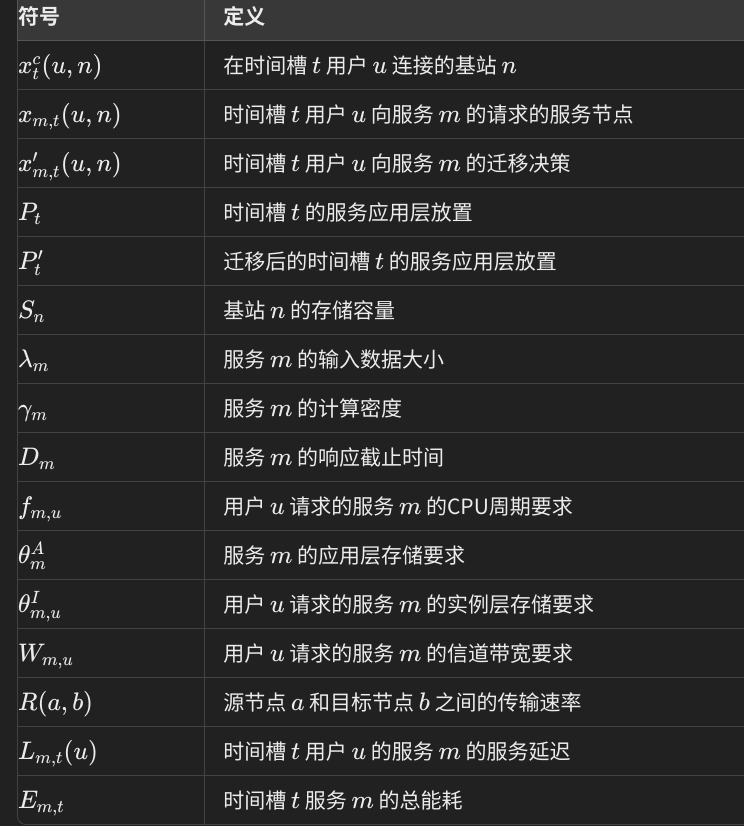
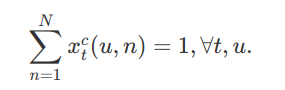

<!-- toc -->

[TOC]

# 资源发现

资源发现是指在边缘计算环境中，移动设备需要及时找到可用的计算资源（如边缘服务器或云服务器）来执行任务。这包括识别最接近且最适合的边缘节点，以及在动态网络环境中快速发现可用资源。这一过程涉及多个技术，如网络感知、位置感知和服务发现协议等。

## 一些算法

### 1. **基于目录的资源发现（Directory-Based Resource Discovery）**

- 方法设计：
  - **目录服务：** 中央目录服务器或分布式目录服务用于维护所有边缘节点及其可用资源的索引。
  - **查询机制：** 移动设备通过查询目录服务获取可用资源的列表。目录服务会根据资源的负载、网络延迟等条件返回最优资源。
  - **优点：** 查询效率高，适合静态或半动态环境。
  - **挑战：** 中央目录可能成为瓶颈，分布式目录需要复杂的同步机制。

### 2. **基于代理的资源发现（Agent-Based Resource Discovery）**

- 方法设计：
  - **智能代理：** 部署在边缘节点或设备上的智能代理会主动发现并推荐资源。代理可以使用本地缓存、学习历史任务数据，以优化资源选择。
  - **分布式协调：** 代理之间可以通过协商或竞标机制，共同决定资源的分配。协商机制可以基于效用函数或策略投标。
  - **优点：** 自适应能力强，适应动态变化的网络环境。
  - **挑战：** 代理间的通信开销和复杂性较高。

### 3. **基于P2P的资源发现（Peer-to-Peer Resource Discovery）**

- 方法设计：
  - **分布式哈希表（DHT）：** 使用DHT来索引和检索资源，提供高效的查询路由。每个节点负责管理一部分资源索引。
  - **随机游走：** 资源发现可以通过随机游走策略，让查询请求在网络中随机传播，直到找到合适的资源。
  - **优点：** 高度分布式，适合大规模动态环境。
  - **挑战：** 查询延迟可能较高，且可能出现查找失败的情况。

### 4. **基于广播的资源发现（Broadcast-Based Resource Discovery）**

- 方法设计：
  - **洪泛搜索：** 移动设备可以广播资源请求给所有邻近节点，所有收到请求的节点都会响应。
  - **限制广播：** 为减少网络流量，设计限次广播或逐层扩展广播（如时间生存值TTL）。
  - **优点：** 简单直接，适合小规模网络。
  - **挑战：** 网络开销大，容易造成广播风暴。

### 5. **基于AI/ML的资源发现（AI/ML-Based Resource Discovery）**

- 方法设计：
  - **预测模型：** 通过机器学习模型预测未来资源需求和可用性，智能调度资源分配。
  - **强化学习：** 使用强化学习方法，设备和边缘节点可以不断学习和优化资源发现策略。
  - **优点：** 动态性和自适应性强，能够应对复杂环境。
  - **挑战：** 需要大量训练数据和计算资源，可能增加系统复杂性。

### 6. **基于协作的资源发现（Collaborative Resource Discovery）**

- 方法设计：
  - **合作式资源分享：** 多个边缘节点合作分享和发现资源，通过合作机制，如任务分发或资源借用，提高资源利用率。
  - **分布式调度：** 协作式调度机制能够根据任务优先级、节点负载情况动态调整资源发现策略。
  - **优点：** 提高资源利用效率，减少单点瓶颈。
  - **挑战：** 协作机制的设计复杂，需要考虑公平性和资源共享的效率。

### 7. **基于物理位置的资源发现（Location-Based Resource Discovery）**

- 方法设计：
  - **地理距离优化：** 根据设备与边缘节点的物理距离优先选择最近的节点，以降低网络延迟。
  - **区域划分：** 将区域划分为多个小区，每个小区内的资源通过区域内广播或P2P方式发现。
  - **优点：** 提高服务质量（QoS），减少延迟。
  - **挑战：** 需要精确的位置感知技术，并可能面临区域内资源不均衡的问题。

## 文献综述

> A. R. Khan, S. Imtiaz and A. H. Farooqi, "A Survey of the Resource Discovery Techniques in the Distributed Computing Systems," 2022 International Conference on IT and Industrial Technologies (ICIT), Chiniot, Pakistan, 2022, pp. 1-6, doi: 10.1109/ICIT56493.2022.9989068. keywords: {Computer architecture;Distributed computing;distributed computing;resource discovery;net-work structures},
>
> 分布式计算系统中的资源发现技术综述

### 不同类型的分布式系统
#### 网格计算环境（稀疏）
包含多个可用资源，这些资源通常位于偏远位置，这些资源在地理上作为一个单元工作。目标是为手头的工作发现最有效的资源。

> Javad Zarrin, Rui L Aguiar and João Paulo Barraca, "Resource discovery for distributed computing systems: A comprehensive survey", *Journal of parallel and distributed computing*, vol. 113, pp. 127-166, 2018.

#### P2P计算系统（点对点）

旨在通过允许对等方之间的资源共享来增强分布式环境的可扩展性。

> S Vimal and S Srivatsa, "A new cluster p2p file sharing system based on ipfs and block-chain technology", *Journal of Ambient Intelligence and Humanized Computing*, pp. 1-7, 2019.

#### 集群计算（集中）

主要考虑调度问题，而不是资源发现。

> Huang Wenzhun, Wang Haoxiang, Zhang Yucheng and Zhang Shanwen, "A novel cluster computing technique based on signal clustering and analytic hierarchy model using hadoop", *Cluster Computing*, vol. 22, pp. 13077-13084, 2019.

### 主要问题

- 可扩展性：随着计算资源的增长 ，发现算法必须保持其性能。
- 效率：最小化用户请求发现适当资源时的响应时间。
- 异构性：满足不同设备的需求。
- 可靠性：定期维护已发现的资源，以消除资源不一致。

### 主要的方法

1. 手动方法

   手动方法依赖于用户手动输入资源请求并选择合适的资源。该方法通常通过模块化的方式处理请求，先接收用户的资源请求，然后按资源与请求的匹配度排序，最后根据访问成本对资源进行分组。虽然这种方法简单直接，但容易出现服务质量问题，因为优化的资源列表是在实时计算的

   > Massimiliano Assante, Leonardo Candela, Donatella Castelli, Roberto Cirillo, Gianpaolo Coro, Luca Frosini, Lucio Lelii, Francesco Man-giacrapa, Valentina Marioli, Pasquale Pagano et al., "The gcube system: delivering virtual research environments as-a-service", *Future Generation Computer Systems*, vol. 95, pp. 445-453, 2019.

2. 基于树的方法

   基于树的方法使用决策树或其他树形结构来组织和管理资源。这些方法通过定期更新节点的属性值，并按优化的顺序存储资源信息，从而快速找到符合用户条件的资源。树结构的优势在于其查找效率（如O(log n)），但在数据不平衡的情况下可能导致查找效率降低

   **感觉红黑树可以解决平衡问题，然后个人感觉这就是在手动方法上面加了一个存储的数据结构？**

   > Mohammad Samadi Gharajeh, "A knowledge and intelligent-based strategy for resource discovery on iaas cloud systems", *Int. J. Grid Util. Comput.*, vol. 12, no. 2, pp. 205-221, 2021.

3. 语义方法

   语义方法利用语义网技术，通过构建领域特定的本体（Ontology）来实现资源发现。这些方法通过存储和管理节点的语义信息，来帮助找到相关领域的资源。然而，由于依赖领域知识，这些方法在可扩展性方面存在局限性

   语义网技术是一种通过为信息赋予明确意义的技术，使机器能够理解和处理数据，而不仅仅是读取。它为数据提供了一个结构化的、标准化的表示形式，使得不同系统之间的数据可以相互理解和处理。

   本体是在特定领域内定义的概念和关系的集合，简单来说，它为某一领域的概念提供了一种标准化的表达方式。例如，在医疗领域，“医生”、“病人”、“治疗”可能都是本体中的概念，而它们之间的关系则可以被清晰地定义出来。

   

   > Aolong Zhou, Kaijun Ren, Xiaoyong Li, Wen Zhang, Xiaoli Ren and Kefeng Deng, "Semantic-based discovery method for high-performance computing resources in cyber-physical systems", *Microprocessors and Microsystems*, vol. 80, pp. 103328, 2021.

4. 基于对象的方法

   基于对象的方法采用面向对象的方式来组织节点和资源信息。资源以对象的形式存储，并根据对象之间的关系进行管理。这种方法在管理大规模节点时具有优势，但由于维护每个对象的元信息的复杂性，可能会导致系统不稳定。

5. 边缘计算方法

   边缘计算方法适用于物联网（IoT）等分布式网络环境，重点在于在边缘设备上发现和管理资源。这种方法可以结合其他方法（如基于树或语义的方法）来优化资源发现，特别适合在性能和服务质量要求较高的场景中应用。

> Gyeongmin Lee, Bongjun Kim, Seungbin Song, Seonyeong Heo and Hanjun Kim, "Comflex: Composable and flexible resource management for the iot", *IEEE Internet of Things Journal*, vol. 8, no. 22, pp. 16406-16417, 2020.

## 一些相关的论文

#### 一种在边缘网络中使用元数据复制进行资源发现的去中心化方法

> I. Murturi and S. Dustdar, "A Decentralized Approach for Resource Discovery using Metadata Replication in Edge Networks," in IEEE Transactions on Services Computing, vol. 15, no. 5, pp. 2526-2537, 1 Sept.-Oct. 2022, doi: 10.1109/TSC.2021.3082305.

##### 问题背景

- 忽视了任务与物联网资源之间的关联性（就是说分配的任务可能是该物联网设备不擅长的）
- 边缘设备和网络组织之间的通信被忽视（比如设备、边缘服务器、云服务器这些之间的通信或者网络拓扑结构）

##### 思路

- 应指定**边缘网络**以去中心化和自动的方式处理发现资源的复杂性（架构上）
  - 以P2P的方式连接边缘设备。一组边缘设备组成一个*集群*（cluster）;而多个相连的集群组成一个边缘网络，分别*是一个边缘邻域*（edge neighborhood）。还存在相应的系统协调器，用于组织发现资源的过程。建立在 Kademlia 协议之上，作为边缘设备之间的通信协议。Kademlia 是用于去中心化 P2P 计算机网络的分布式哈希表 （DHT）。当边缘设备更新其本地 DHT 时，这些更改会传播到所有其他设备，从而允许再次查询和操作它们。同样，有关当前集群协调员和全局协调员的信息也存储在 DHT 中。协调器是动态放置的，并在提供各种服务的最合适的边缘设备上运行，动态评估。
- 发现边缘段的可用资源（发现过程）
  - 以自动方式在边缘设备之间交换有关可用资源的信息：
    - i）在整个系统中共享资源
    - ii）边缘设备在本地执行复杂的查询
- 通过提供有关功能及其属性的某些核心信息来描述资源。这种类型的描述称为资源的元数据，在边缘设备之间复制并以分布式的方式存储。
- 根据每个边缘设备的资源偏好处理隐私方面，确保并非所有资源都在整个系统中公布

邻居集群是通过使用系统调用（即 *traceroute 命令*）来找到的，该命令估计与其他集群协调器的接近程度（即，使用跃点计数和延迟）。

##### 场景

城市自然灾害，无人机配备多种计算能力和传感器。考虑三层云基础设施：云、雾、边缘。雾设备提供计算和长期存储功能。

每个簇都有一个协调器设备（即带有绿色圆圈）和一个全局协调器设备（即带有红色和绿色圆圈）。我们假设集群协调器充当*超级对等体* [35] 。每个集群协调器都跟踪同一集群中的其他协调器和设备（即 IP 地址、端口）。同样，同一集群中的边缘设备相互存储信息，并始终了解其集群协调器和全局协调器。集群协调器可能对设备子集承担各种职责（即，监视、发现资源等）。全局协调器负责监控协调器，在集群之间交换资源描述，并在边缘云基础设施中编排边缘应用程序（即控制弹性、迁移任务等）。

在本文中，我们主要关注三个方面：i）在边缘邻域中组织边缘设备，ii）确定最适合放置全局和集群协调器的设备，以及iii）在异构和动态的边缘邻域上实现自动资源发现。

# 资源切换

资源切换是指当移动设备在不同的网络环境或物理位置间移动时，需要无缝地切换正在使用的边缘资源。例如，当设备从一个边缘节点移动到另一个节点的覆盖范围内时，需要确保计算任务的迁移不会影响用户体验。这包括数据迁移、会话保持以及计算任务的状态保持等技术。

## 一些算法

### 1. **基于信号强度的切换（Signal Strength-Based Handoff）**

- 方法设计：
  - **信号测量：** 移动设备通过持续测量当前连接节点的信号强度。当信号强度低于阈值时，触发切换。
  - **切换策略：** 系统会搜索周围其他边缘节点的信号强度，并选择信号最强的节点进行切换。
  - **优点：** 简单直观，易于实现。
  - **挑战：** 容易产生频繁切换，特别是在信号强度波动较大的情况下。

### 2. **基于位置预测的切换（Location Prediction-Based Handoff）**

- 方法设计：
  - **位置跟踪：** 使用GPS或其他定位技术跟踪设备的位置变化。
  - **运动预测：** 通过历史位置数据和运动模式预测设备的未来位置，从而提前确定可能的切换节点。
  - **优点：** 提前准备切换，减少服务中断。
  - **挑战：** 需要精确的运动预测算法，且在复杂环境下定位精度可能受限。

### 3. **基于负载均衡的切换（Load Balancing-Based Handoff）**

- 方法设计：
  - **负载监控：** 持续监控当前边缘节点的计算和网络负载，当负载超过设定的阈值时，启动切换。
  - **动态分配：** 切换到负载较轻的节点，以保证服务质量（QoS）。
  - **优点：** 保证节点的高效利用，防止过载。
  - **挑战：** 可能引入额外的延迟，尤其是在负载波动较大时。

### 4. **基于延迟感知的切换（Latency-Aware Handoff）**

- 方法设计：
  - **延迟测量：** 持续监测当前节点到设备之间的通信延迟。
  - **切换决策：** 当延迟超过某个阈值时，系统将设备切换到延迟较低的节点。
  - **优点：** 提高用户体验，适合对延迟敏感的应用（如视频流或在线游戏）。
  - **挑战：** 需要实时的延迟监测，并且在网络拥塞时可能难以找到更好的节点。

### 5. **基于上下文感知的切换（Context-Aware Handoff）**

- 方法设计：
  - **多参数感知：** 结合多种上下文信息（如设备电量、用户行为、网络状况）来做出切换决策。
  - **自适应切换：** 根据不同的应用需求和用户偏好，动态调整切换策略。
  - **优点：** 更智能的切换决策，提高服务的个性化体验。
  - **挑战：** 系统复杂度高，需要处理和分析大量上下文信息。

### 6. **基于AI/ML的切换（AI/ML-Based Handoff）**

- 方法设计：
  - **机器学习模型：** 通过训练模型来预测最优切换节点，学习不同环境下的最佳切换策略。
  - **强化学习：** 使用强化学习算法，设备和边缘节点可以在运行中不断优化切换策略。
  - **优点：** 适应复杂动态环境，能够自动调整切换策略。
  - **挑战：** 需要大量数据和计算资源，且训练过程可能较为复杂。

### 7. **基于多路径的切换（Multi-Path-Based Handoff）**

- 方法设计：
  - **多路径连接：** 在设备同时保持多个边缘节点的连接，选择最佳路径传输数据。
  - **切换时机：** 当主路径的性能下降时，系统自动切换到次优路径，确保服务连续性。
  - **优点：** 提高了切换的可靠性和稳定性。
  - **挑战：** 资源开销较大，且管理多路径连接的复杂性较高。

## 相关论文

### 多用户异构密集蜂窝网络的高能效业务迁移

> X. Zhou, S. Ge, T. Qiu, K. Li and M. Atiquzzaman, "Energy-Efficient Service Migration for Multi-User Heterogeneous Dense Cellular Networks," in *IEEE Transactions on Mobile Computing*, vol. 22, no. 2, pp. 890-905, 1 Feb. 2023, doi: 10.1109/TMC.2021.3087198. 

#### 摘要

业务迁移作为一个优化问题，目的是在满足服务延迟要求的同时，同时考虑到不同用户之间的干扰，最大限度地降低平均能耗。

开发了一种基于 Lyapunov 和粒子群优化的高效节能在线算法，称为 EGO，可以在不预测用户轨迹的情况下解决原始问题。

#### 方法设计

在每个基站设置三层结构：

**基础层（Base layer）**：这是最底层的，类似于操作系统，是每个边缘服务器上通用的部分。无论是哪种服务或用户，这一层都是一致的，负责提供基本的计算资源和环境支持。

**应用层（Application layer）**：这一层位于基础层之上，由多个用户共享。它包含了特定的服务应用程序，也就是运行在边缘服务器上的实际业务逻辑和功能。当不同用户请求相同的服务时，他们会共享同一个应用层。

**实例层（Instance layer）**：这是最上层，与具体的用户绑定，包含该用户的服务状态信息，比如请求历史、用户信息以及其他私密数据。每个用户的实例层都是独立的，用于保存用户的个性化数据。

如果目标边缘服务器中已经部署了应用层，则用户只需从上一个服务节点（相邻的 BS）迁移其实例层即可。否则，用户需要同时迁移应用层和实例层。

#### 具体建模

这个公示代表，用户在某一时间槽只连接到一个基站：

这个$$x'$$是指的t时刻将要迁移的服务，感觉有点导数的那个意思，也即下一时刻的状态

这个是指t时刻n基站上的m服务，如果存在有人在申请（$$\ge1$$），那么这个$$P_t(m,n)$$（**P**lace服务的数量）就是1，如果一个都没申请，那么就是0.

用八元组来表示一个服务：
$$
<λ_m,γ_m,D_m,f_{m,u},θ^A_m,θ^I_{m,u},W_m,ω_m>
$$
具体含义见上面的表格

以下三个公式分别对基站$$n$$上某个时刻迁移服务时的最大CPU频率、最大存储容量、最大信道带宽进行了约束，就是在任何一个时刻，迁移时的这三个值都不得超过最大值
$$
\begin{equation*} \sum \limits _{m=1}^M\sum \limits _{u=1}^U f_{m,u} x_{m,t}^\prime (u,n) \leq F_n,\forall t,n, \end{equation*}
$$

$$
\begin{equation*} \sum \limits _{m=1}^M\Bigg [\sum \limits _{u=1}^U \theta _{m,u}^I x_{m,t}^\prime (u,n) + \theta _m^A P_t^\prime (m,n)\Bigg ] \leq S_n,\forall t,n,\end{equation*}
$$

$$
\begin{equation*} \sum \limits _{m=1}^M \sum \limits _{u=1}^U W_{m,u} x_{m,t}^\prime (u,n) \leq W_n,\forall t,n, \end{equation*}
$$

传输速率: $$\begin{equation*} R(a,b)=W\log _{2}\left(1+\frac{p_{a} h d(a,b)^{-3}}{N_0}\right) \end{equation*}$$，其实我感觉这里面的符号都不太用看

传输延迟包含两部分，第一部分是用户将请求发送到其连接的基站（BS）的延迟。这部分的精确时间无法捕获，用常数$$C$$表示；第二部分是从用户连接的基站传到用户服务的基站（这里不太理解，连接的基站不就是服务的基站？还是说是切换后的这样的基站？**实际上这里讨论的是，如果某个连接的基站上没有某项服务，那么他会通过路由将请求转发到有服务的基站上，所以这应该是不考虑应用迁移，只考虑路由转发的情况**）传输延迟计算公式：
$$
\begin{equation*} l_{m,t}^{tra}(u) = \frac{\lambda _m}{ R(\pi _{t,u}^c,\pi _{m,t,u})} + C \end{equation*}
$$
其中：
$$
\begin{equation*} \pi _{t,u}^c=\arg\max \limits _{n} x_{t}^c(u,n)\end{equation*}
$$

$$
\begin{equation*} \pi _{m,t,u}=\arg \max \limits _{n} x_{m,t}(u,n)\end{equation*}
$$

其实就是从t时刻用户连接的那个BS传到t时刻用户访问服务的BS

计算延迟：
$$
\begin{equation*} l_{m,t}^{com}(u) = \frac{\lambda _m\gamma _m}{f_{m,u}}\end{equation*}
$$
**如果是服务迁移**，从一个基站$$n$$迁移到另一个基站$$n'$$，迁移延迟是
$$
\begin{equation*} l_{m,t}^{app}(n) = \min \bigg\lbrace \frac{\theta _m^A |P_t^\prime (m,n)-P_{t}(m,n)|}{P_t^\prime (m,n^\prime)R(n,n^\prime)}|n^\prime = 1,\ldots,N\bigg\rbrace  \end{equation*}
$$

### 区块链

> P. Lang, D. Tian, X. Duan, J. Zhou, Z. Sheng and V. C. M. Leung, "Blockchain-Based Cooperative Computation Offloading and Secure Handover in Vehicular Edge Computing Networks," in IEEE Transactions on Intelligent Vehicles, vol. 8, no. 7, pp. 3839-3853, July 2023, doi: 10.1109/TIV.2023.3271367.

### 基于预测

> P. Guan, Y. Li and A. Taherkordi, "A Prediction Based Resource Reservation Algorithm for Service Handover in Edge Computing," 2023 IEEE 10th International Conference on Cyber Security and Cloud Computing (CSCloud)/2023 IEEE 9th International Conference on Edge Computing and Scalable Cloud (EdgeCom), Xiangtan, Hunan, China, 2023, pp. 330-335, doi: 10.1109/CSCloud-EdgeCom58631.2023.00063.
